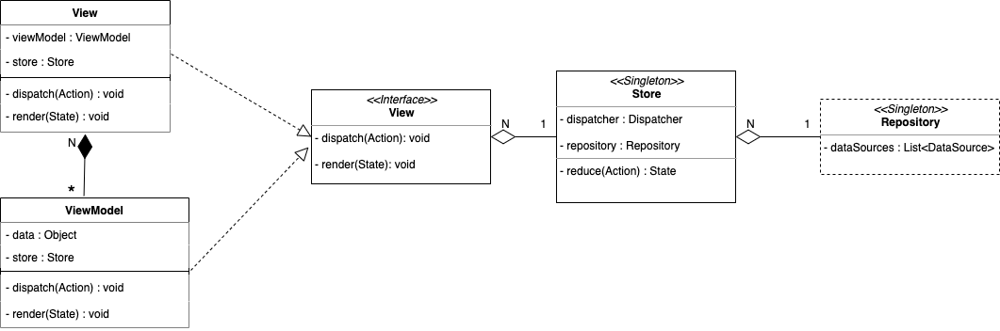
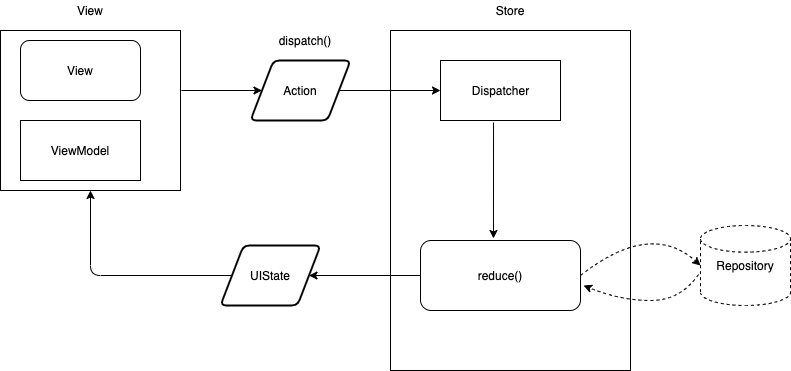

# mvi_base
Base classes for MVI architecture

This model is inspired by Redux and Flux models. Some core actors stay the same as in Redux but their behaviors might change to adapt to the requirements of Android's environnement. The idea, similarly to Flux's original purpose, revolves around a **strict unidirectional data flow**. 

The main actors in the model are:

- **View**: this is the starting point of a flow. It dispatches an _Action_ to _Store_. When _Store_ sends back output, _View_ updates UI within `render()` method. This method is also the endpoint of the flow. Thus, a complete and close flow is always starting from a _dispatch()_ and finishing with `render()`. In this part, there are 2 smaller elements, _View_ and _ViewModel_. Unlike in MVVM model, _ViewModel_ here is no more than a state manager (thanks to the principle of _ViewModel_ from _Jetpack_) for _View_. It does not contain any logic business. 

    - Codes in _ViewModel_ are less (or even not) _Android_ than in _View_; it only helps to hold and to mutate states.

    - Typically, _View_ performs all actions related to UI. On top of that, it helps to bind data from _ViewModel_ to UI

    - Relation between _View_ - _ViewModel_ is : `n..1`

- **Action** : this defines what will happen. Unlike in Redux, Action carries and transfers the current state of view

- **Store** : unlike _Store_ in redux, this _Store_ does not hold states of application, but instead acts as:

    - a singleton

    - a *Reducer* carrier
    
    - a communication point between _View_ components (fragments, activity)

- **Reducer** : in redux, _Reducer_ forms an object with a unique function which is `reduce()`. However, in this model, object `Reducer` no longer exists but its magic method `reduce()` is integrated directly in _Store_.This method is a pure function that takes _Action_ as input and returns _State_. This is where all core logics happen. Hence, to keep it maintainable and testable, there are certain things that should never happen in `reduce()` function:

    - Mutate the arguments
    
    - Perform side effect actions.

- **State**: this is an updated state container that will be sent to _View_ to `render()`

# Structure of base classes

To keep a certain abstraction level, some base classes are created to perform the relation between components in the architecture.

- **BaseView** (BaseFragment, BaseActivity):  Each _View_ is defined with 3 dependencies: type of Action, type of State and type Store. As a typical element in _View_ part, _BaseView_ provides _dispatch()_ and `render()` methods. It contains a _Store_ reference and possibly a corresponding _ViewModel_ one (or shareViewModel), if state management is required. This _ViewModel_ reference can be bound to xml layout and benefits from _DataBinding_.

- **BaseViewModel**: this is a Lifecycle observer because its lifecycle depends on the lifecyle of the _View_ it is attached to. Since this component is a part in the big _View_, _BaseViewModel_ also provides _dispatch()_ and `render()` and holds a reference of _Store_. On top of that, it may (or _should_ because purpose of its existence is to manage states of View) contain states.

- **render()**: this method should not be called outside of a flow. States will not be changed without an action dispatched.

- **BaseStore**: except some core elements like `reduce()` method mentionned above, _BaseStore_ contains a *Dispatcher* which does some pre-setup (things like providing executor for action) for every action dispatched. Moreover, _BaseStore_ provides methods to *subscribe* and *unsubscribe* to state changes. _BaseStore_ is a singleton at module level. 

\* I'm not sure whether _"module"_ describes exactly what I meant. However, imagine a process that can work independently. For instance, in my projects, there are different processes: authentification (login/register/password reset), main flow, payment, etc. Since each module contains only one Activity, the Store depends on the lifecycle of that Activity.
- **reduce()**: knowing that I'm currently using RxJava for my threading and reactivité handling, so `reduce()` is a chain of Rx operators starting from an _Observable\<Action\>_ and returning an _Observable\<State\>_
  
- **Dispatcher**: it filters the action received from _View_ and prepares environment for the execution.

# Flow (what you have to do after having all base classes ready)

To start a flow:

- Describe what you want to do by defining an Action class with required data.

- From either _BaseView_ or _BaseViewModel_, `dispatch()` that action.

- Handle action in `reduce()` method of _Store_ while defining an _State_ returned.

- Update UI in `render()` _View_ or update state in  `render()` of _ViewModel_.

- And then, you are good.

# Analyse
####  Avantages
- This model benefits from **unidirectionnal flow**:
    - Easier to debug because at any point of a flow, you know where it comes from
    - System of Action/State helps you have more control over your data
    
- Core logics of application are situated in Store within `reduce()` method, and the fact that this is a _pure-function_ makes it obviously easy to test.

- Communication between components is done with the helps of Publish/Subscribe pattern and abstraction layer, it makes the system loosely coupled and avoids mixing Android framework codes with Java codes

#### Disadvantages

- Many classes are generated (Action/State) when you want to execute a flow. It will get harder to manage _Action_ and _State_ classes when system becomes massive